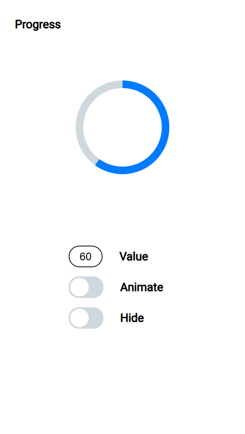
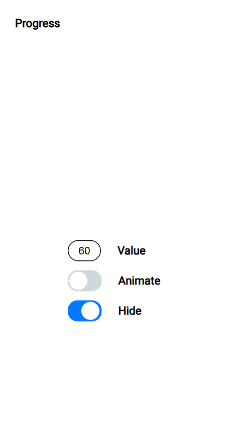
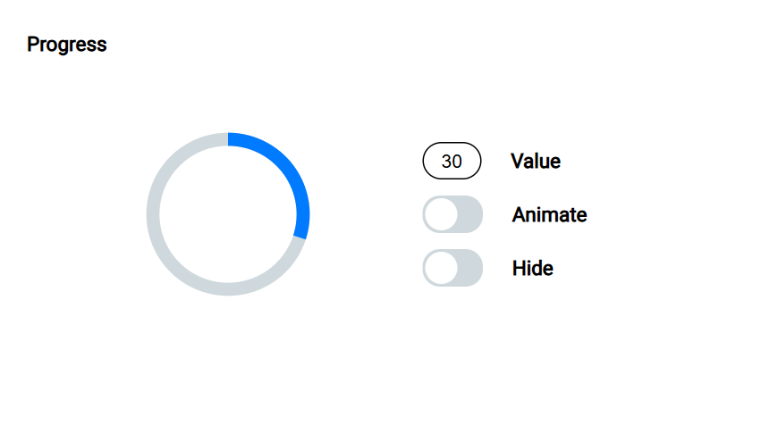
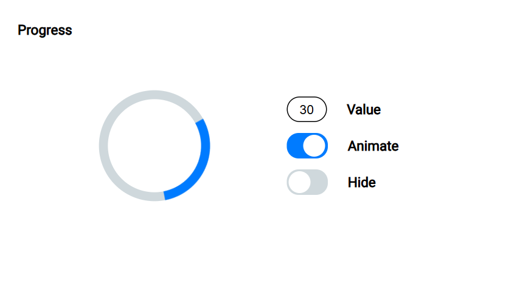

# CircularProgress

## Описание проекта

CircularProgress -- это приложение, предназначенное для отображения процесса и прогресса выполения. Разработано с использованием HTML, CSS и JavaScript.

## Ссылка на сайт:

https://tv-tugova.github.io/CircularProgress

## Функционал:

- Валидация ввода
- Управление индикатором выполения через числовое поле Value
- Запуск анимации вращения
- Изменение видимости progress bar
- Адаптация под мобильные устройства и ориентацию экрана

## Установка и запуск проекта:

Клонировать репозиторий:

    git clone https://github.com/tv-tugova/CircularProgress.git

Установить зависимости:

    npm i

Запустить приложение:

    npm start

## Скриншоты:

